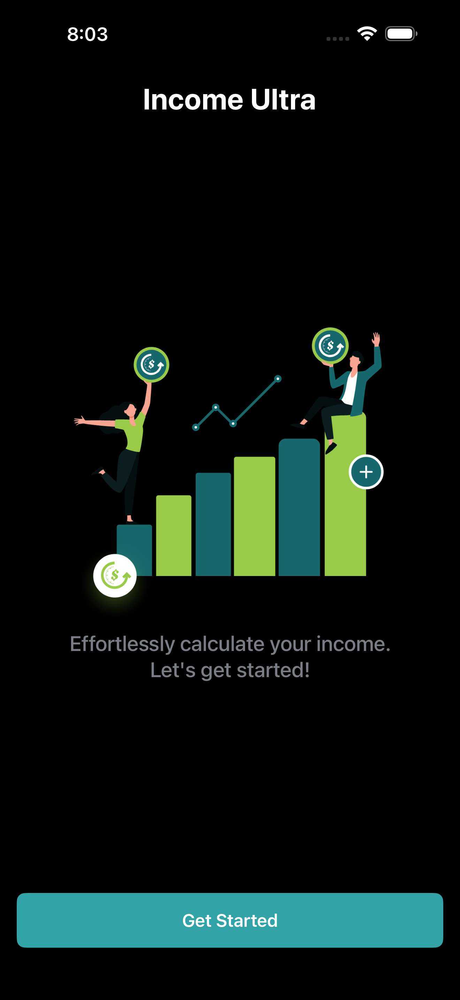

# Income-Ultra 💰

A modern, intuitive iOS app for calculating and visualizing income across different pay periods. Whether you're a salaried employee or an hourly worker, Income-Ultra makes it easy to understand your earnings with beautiful, native SwiftUI design.


## 📱 Screenshots

<p align="center">
  
  
  
</p>

<p align="center">
  
  
  
</p>

## ✨ Features

### 💵 Comprehensive Income Calculation

- **Salary Calculator**: Input your annual salary and take-home percentage to see detailed breakdowns
- **Hourly Calculator**: Calculate earnings based on hourly wage with overtime support
- **Multiple Pay Periods**: View income broken down by:
  - Weekly
  - Bi-weekly
  - 4-weekly (every 4 weeks)
  - Monthly
  - Yearly

### 🎯 Smart Features

- **Overtime Calculation**: Automatically calculates 1.5x overtime rate for hours over 40/week
- **Take-Home Estimation**: Factor in your take-home percentage for accurate net income calculations
- **Real-time Updates**: See results update instantly as you type

### 🎨 Beautiful Design

- **Native SwiftUI**: Built entirely with SwiftUI for a smooth, native iOS experience
- **Dark Mode Support**: Seamlessly switch between light and dark themes
- **Custom Color System**: Thoughtfully designed color palette for excellent readability
- **Intuitive UI**: Clean, modern interface that's easy to navigate

### 📊 Detailed Breakdowns

- View both gross and take-home pay
- Compare different payment frequencies at a glance
- Understand your hourly wage equivalent (for salaried employees)

## 🛠 Technical Details

### Requirements

- **iOS**: 26.0+
- **Xcode**: 16.0+
- **Swift**: 6.0+

### Architecture

- **MVVM Pattern**: Clean separation of concerns with ViewModels
- **Dependency Injection**: Using [Factory](https://github.com/hmlongco/Factory) for dependency management
- **SwiftUI**: 100% SwiftUI implementation
- **Combine Framework**: For reactive data flow

### Key Technologies

- SwiftUI
- Combine
- Factory (Dependency Injection)
- UserDefaults for persistence
- Custom color assets for theming

## 📁 Project Structure

```code
Income-Ultra/
├── Core/                    # Main app screens and view models
│   ├── Components/          # Reusable UI components
│   ├── AppStartingView      # App entry point
│   ├── HomeTabView          # Main tab navigation
│   ├── IncomeView          # Income calculator screen
│   ├── SettingsView        # Settings and preferences
│   └── WelcomeView         # Onboarding screen
├── Domain/                  # Business logic and models
│   ├── Pay                 # Income calculation models
│   ├── HourlyInput/Output  # Hourly wage models
│   └── SalaryInput/Output  # Salary calculation models
├── Extensions/             # Swift extensions
│   └── Views/             # View modifiers and helpers
├── Stores/                # Data layer
│   ├── AppInfo/          # App information store
│   └── Income/           # Income calculation logic
└── Assets/               # Images and color assets
```

## 🚀 Getting Started

### Prerequisites

- macOS with Xcode installed
- Apple Developer account (for device testing)

### Installation

1. Clone the repository:

```bash
git clone https://github.com/[your-username]/Income-Ultra.git
cd Income-Ultra
```

2. Open the project in Xcode:

```bash
open Income-Ultra.xcodeproj
```

3. Build and run the project:
   - Select your target device/simulator
   - Press `Cmd + R` to build and run

### Dependencies

The project uses Swift Package Manager for dependency management. Dependencies will be automatically resolved when you open the project.

Current dependencies:

- [Factory](https://github.com/hmlongco/Factory) - v2.5.3+

## 🎯 Usage

### Calculating Salary-based Income

1. Open the app and navigate to the Income tab
2. Select "Salary" from the picker
3. Enter your annual gross salary
4. Adjust the take-home percentage (default: 83%)
5. View your income breakdown across all pay periods

### Calculating Hourly Wages

1. Select "Hourly" from the picker
2. Enter your hourly wage
3. Specify hours worked per week
4. Adjust take-home percentage
5. Enable overtime calculation if working over 40 hours/week
6. View your projected earnings

## 🤝 Contributing

Contributions are welcome! Please feel free to submit a Pull Request.

1. Fork the project
2. Create your feature branch (`git checkout -b feature/AmazingFeature`)
3. Commit your changes (`git commit -m 'Add some AmazingFeature'`)
4. Push to the branch (`git push origin feature/AmazingFeature`)
5. Open a Pull Request

## 📝 Version History

- **1.0.0** - Initial release
  - Salary and hourly income calculators
  - Multiple pay period breakdowns
  - Dark mode support
  - Overtime calculation

---
